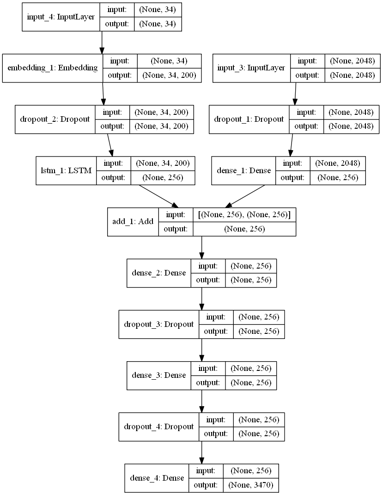
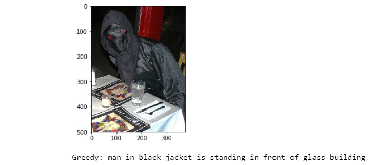
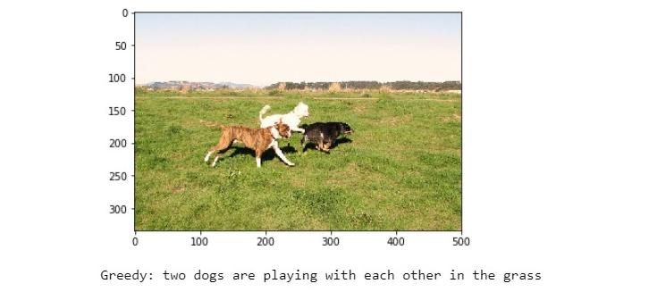

# Image-captioning-using-Keras
Caption generation is a challenging artificial intelligence problem where a textual description must be generated for a given photograph. 
Used Inception v3 model to extract features from images and used global word2vec to process text then added both the outputs then fed them to a LSTM.
# Prerequisites
* Python
* Tenserflow
* Keras
* Dataset:<a href="https://forms.illinois.edu/sec/1713398">Fill the form to  download the dataset</a>
* <a href="http://nlp.stanford.edu/data/glove.6B.zip">Glove</a>
# Dataset Preparation
* Copy all the images to the folder called "Flicker8k_Dataset" in your working directory.
* Copy Flickr8k.token.txt,Flickr_8k.trainImages.txt,Flickr_8k.testImages.txt in your working directory.
* Also copy glove in your working directory.
# Image Processing
*  Here inception v3 model is used.
* The last layer is removed.
* The data found after passing all the images is stored in as a pickle file.
# Text processing
* The Flickr8k.token.txt file contains information in the format "imageName# CaptionOfImage\n"
* We create a dictionanry which conatins key as the image name and values as the list of their corresponding values.
* Remove special charcaters and words with length less than 2.
* Add the word "starting " to the start of every caption and " ending" to the end of every caption.
* Find the 200dim glove value for every word i the vocabulary.
# Model architecture

# Test results

 
